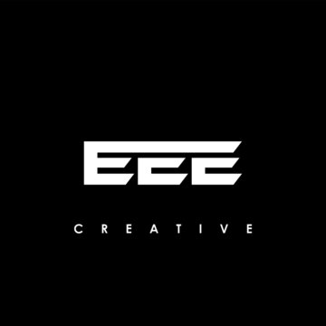

# EEE Store ✨ vol.2

  

This is a simple web store project for selling various products, implemented with HTML and JavaScript. It includes features such as displaying products with images and descriptions, adding items to the shopping cart, collecting user information during checkout, and processing purchases via Google Sheets using Google Apps Script.

## Website Preview

   
  
   
  

### Technologies Used

  
  
  
  
  
  
  
  
  
  

### 
 Screen Shot 

### Getting Started

To run this project locally:

1. Clone this repository.
2. Open the project folder in your preferred code editor.
3. Open the `index.html` file in a modern web browser.

### Features

- **Product Display**: Showcase various products with images, names, prices, and descriptions.
- **Add to Cart**: Allow users to add products to their shopping cart with real-time updates.
- **Checkout Process**: Collect user information (name, phone number, city) during checkout for order processing.
- **Google Sheets Integration**: Utilize Google Apps Script to submit purchase details to Google Sheets for backend processing.
- **Responsive Design**: Ensure compatibility and usability across different screen sizes.

### Usage

To contribute to this project, follow these steps:

1. Fork the repository.
2. Clone the forked repository to your local machine.
3. Make changes and create a new branch.
4. Push your changes to the branch in your fork.
5. Open a pull request to the main branch of the original repository.

Upon opening a pull request, GitHub Actions will automatically run the CI workflow, testing your changes against multiple versions of Node.js. Ensure that all tests pass before merging your changes.

Simply open the `index.html` file in your web browser to explore and purchase products from the EEE Store.

## License

This project is licensed under the terms of the MIT license. See the [LICENSE](LICENSE.md) file for details.

---
© 2024 Ali Cheikh. All rights reserved.
